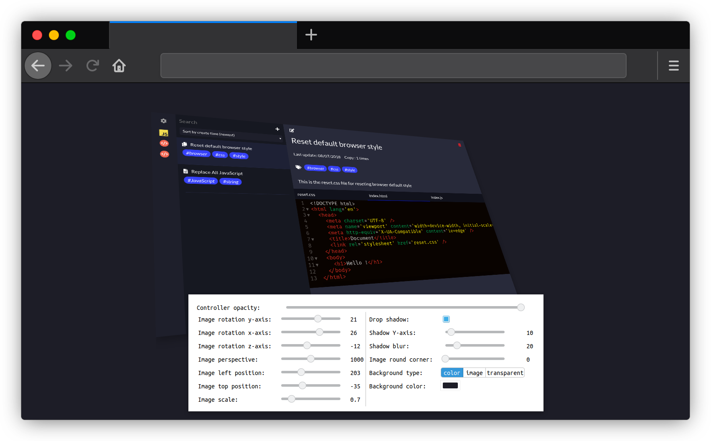
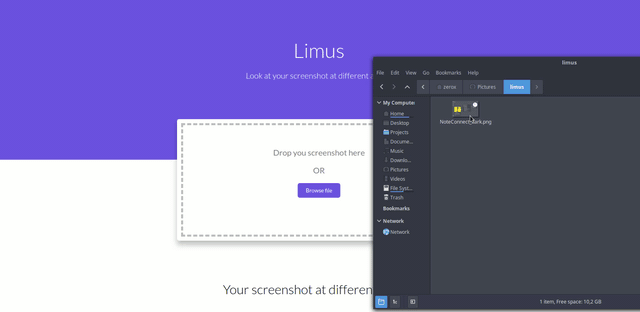

<p align="center">
  
</p>

<p align="center" style="font-weight: bold; text-align: center; font-family: monospace; padding-bottom: 15px;">Look at your screenshot at different angles</p>

<p align="center">
  
</p>

## Introduction

<p align="center">
  
</p>

Remember those fancy rotated app screenshots that you saw? Well, I find it very inconvenient to do all those transformations on Photoshop or similar tools. Therefore, I created this tool to help you transform your screenshots/images faster and easier.

## How to use?

### Online

The easiest way to use this app is to use it online at [limus.netlify.app](https://limus.netlify.app/)

<p align="center">
  
</p>

### Self-hosted

You can also clone the app and host it yourself. To self-host the app, you can follow these steps:

1. Clone the repository

```
git clone https://github.com/ZeroX-DG/limus
```

2. Install dependencies

```
npm install
```

3. Build the app

```
npm run build
```

4. Deploy the `dist/` folder just like a static web page.

## Features

#### Rotate

By adjusting the `x`, `y`, `z` rotation parameter, you can rotate you image to the angle that you desire.

#### Scaling

When you first upload the image, you might find it too big or too small for your shot. That's because Limus displays your image using its' original size without scaling. However, you can choose to scale up or down the picture using the `Image scale` slider.

#### Drop shadow

Having a shadow drop can be very convenient when you have an image that can blend in with the background. With Limus, you have the option to adjust the shadow position as well as how blurry you want your shadow to be.

#### Different types of background

With Limus, you can also change the background of the shot from a plain colour background to transparent background or even using an image as a background!

#### Free-transform

If you are having trouble adjusting your image with the `x`, `y`, `z` rotation sliders, you can always hold the <kbd>Shift</kbd> key, and the app with go into free-transform mode. In this mode, you can freely rotate your image by dragging the image using your mouse.

## Author

Limus is a project by:
- Viet Hung Nguyen ([@ZeroX-DG](https://github.com/ZeroX-DG/))

### License

- [MIT](/LICENSE)

## Contribute & Support

All pull requests are welcome!

If you found this app helpful and wish to support the author. You can buy him a coffee...though he would prefer tea instead, but coffee is fine.

[](https://ko-fi.com/Z8Z81ODLC)
